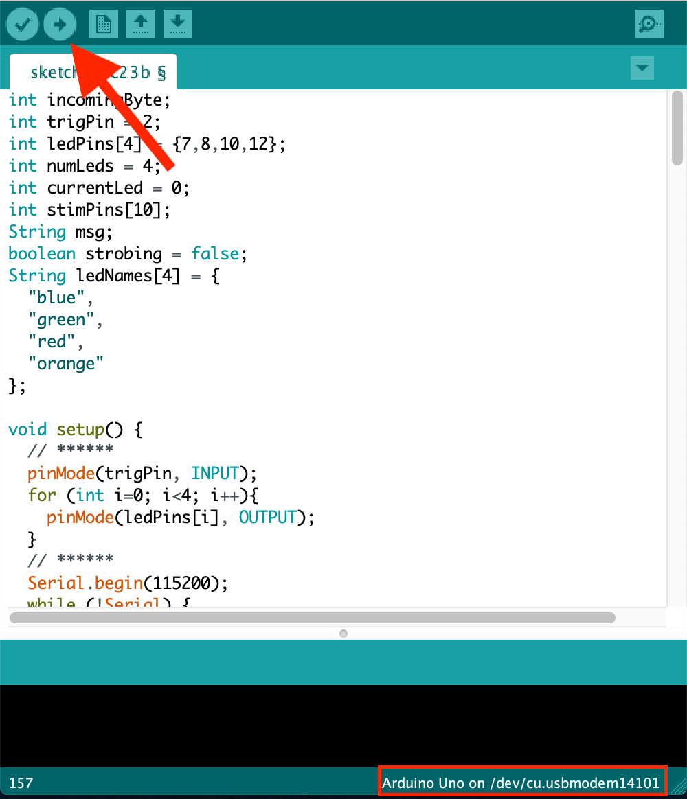

.. _arduino_page:

.. _`Arduino` : https://arduino.cc/
.. _`Arduino IDE` : https://www.arduino.cc/en/software/
.. _`Arduino MEGA` : https://store.arduino.cc/usa/mega-2560-r3
.. _`pyWFOM Arduino File` : https://raw.githubusercontent.com/ryan-byrne/pywfom/master/files/pywfomArduino/pywfomArduino.ino

Arduino Setup
=============

Running :py:mod:`pywfom` requires first setting up an `Arduino`_
to be used with the system.

Installing the Arduino IDE & Drivers
------------------------------------

Download the `Arduino IDE`_ for your Operating System and follow the
instructions on your screen.

Any required USB Drivers will be installed alongside the `Arduino IDE`_.

Deploying to the Arduino
------------------------

1.  Attach the `Arduino`_ you wish to use with your :py:mod:`pywfom` system to your
    machine via USB.

  * **NOTE:** `Arduino MEGA`_ is suggested

2. Download the `pyWFOM Arduino File`_

3. Start the `Arduino IDE`_, and open the `pyWFOM Arduino File`_

4. Verify the correct device and port are selected

.. figure:: img/correctport.png
  :align: center
  :width: 500

  These can be changed from the ``Tools`` Menu

5. Deploy the code to the Arduino_

  Wait until the code successfully deploys

6. :py:mod:`pywfom` is now able to send settings to your Arduino_

Attaching Devices
-----------------

Adding devices to your :py:mod:`pywfom` system is as simple as attaching them
to the pins of your Arduino_.

The example below shows 3 separate BNC connectors attached to an exposure
trigger from a **sCMOS camera** and **two LED drivers**.

.. figure:: img/simple_arduino.png
  :align: center
  :width: 500

  Simple wiring diagram including a single sCMOS Camera and 2 LEDs

:py:mod:`pywfom` would send this information to the Arduino_ using the
``strobing`` setting in ``config.json``.

Take a look at the section on the :ref:`JSON Configuration File`.

.. code-block:: json

  {
    "strobing": {
      "leds":[
        {
          "name":"led1",
          "pin":2
        },
        {
          "name":"led2",
          "pin":5
        }
      ],
      "trigger":11
    ]
  }
